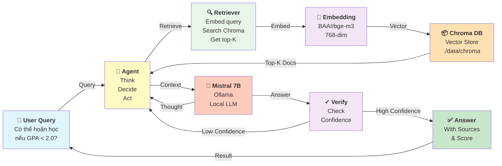
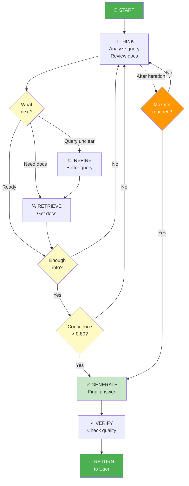
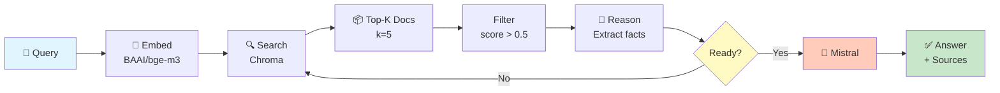
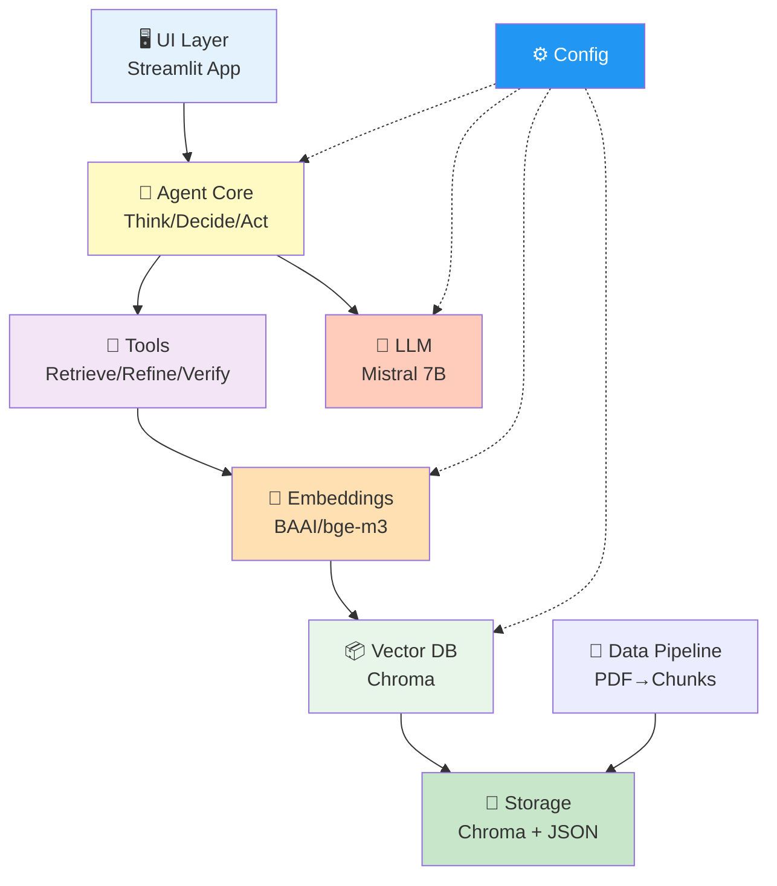
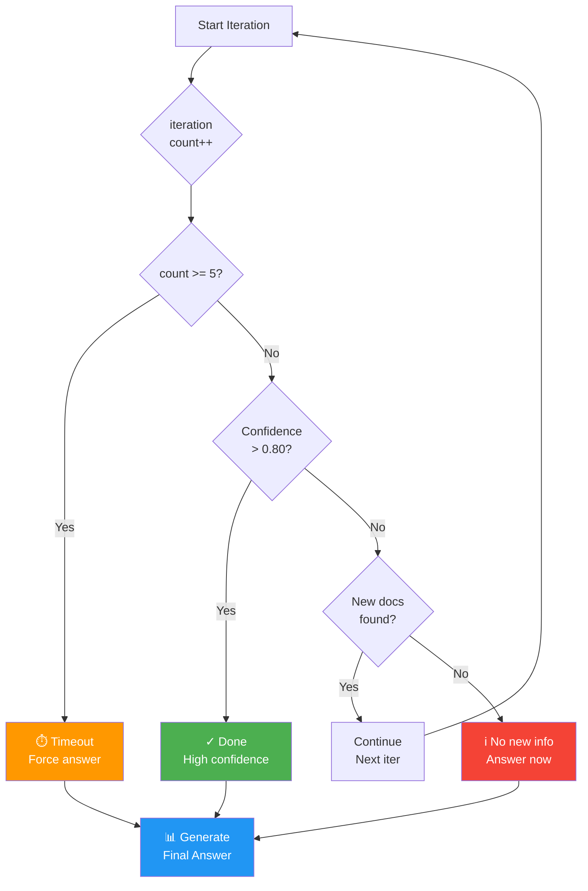
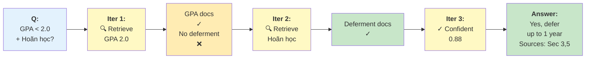
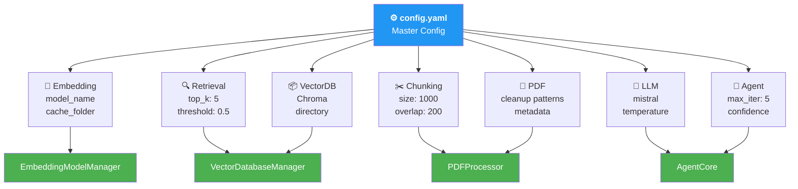

# Agentic RAG - Kiến Trúc Tổng Thể (Mermaid Diagram)

## 1. Toàn Bộ Luồng Hệ Thống

---

## 2. Agent Reasoning Loop (Chi Tiết)

---

## 3. Data Flow: Query → Retrieval → Answer

---

## 4. Component Architecture

---

## 5. Iteration Control & Termination

---

## 6. Query Example: Complex Regulation Question

---

## 7. System Configuration Flow

---

## 📋 Chú Thích

- **🤖 Agent**: Quyết định what to do next dựa trên LLM reasoning
- **🔄 Iteration Loop**: Tối đa 5 vòng, dừng khi confident hoặc hết vòng
- **🔍 Retriever**: Lấy top-K documents từ Chroma vector store
- **✏️ Refiner**: Tạo query synonyms nếu cần tìm lại
- **✓ Verifier**: Kiểm tra confidence score của answer
- **📦 Chroma DB**: Vector database lưu embeddings của tất cả chunks
- **🧬 BAAI/bge-m3**: Multilingual embedding model 768-dim
- **🔌 Mistral 7B**: Local LLM via Ollama, không qua cloud

---

## 🎯 Key Features

✅ **Multi-iteration reasoning** - Agent tự refine query nếu cần  
✅ **Confidence-based** - Dừng khi confidence > 0.80  
✅ **Tool-based** - Modular tools (retrieve, refine, verify, extract)  
✅ **Config-driven** - Tất cả settings từ config.yaml  
✅ **Local & Private** - Ollama + Chroma, no cloud APIs  
✅ **Source attribution** - Trả lại source của mỗi answer
