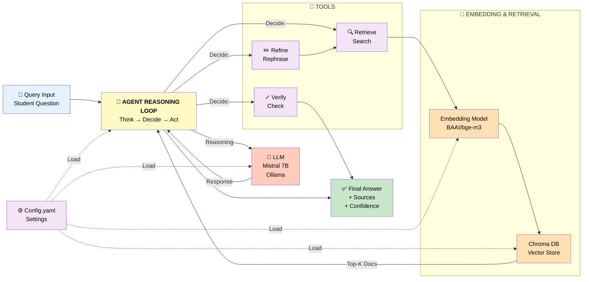
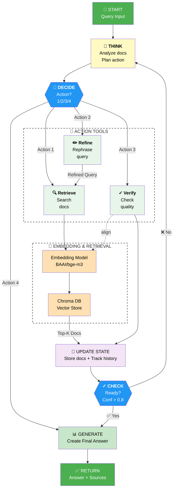
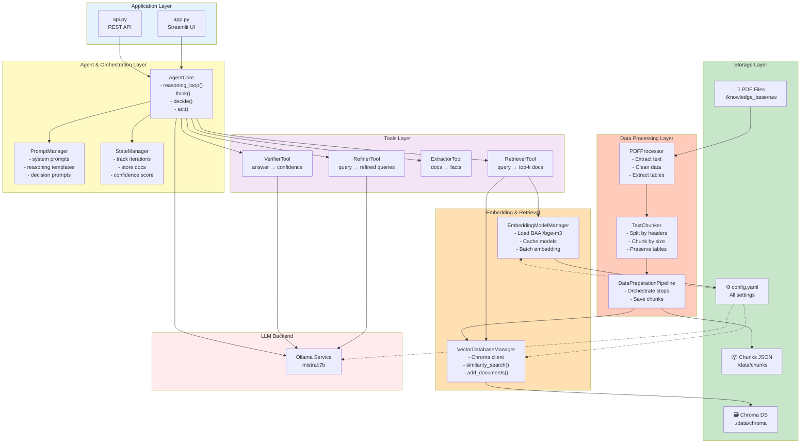
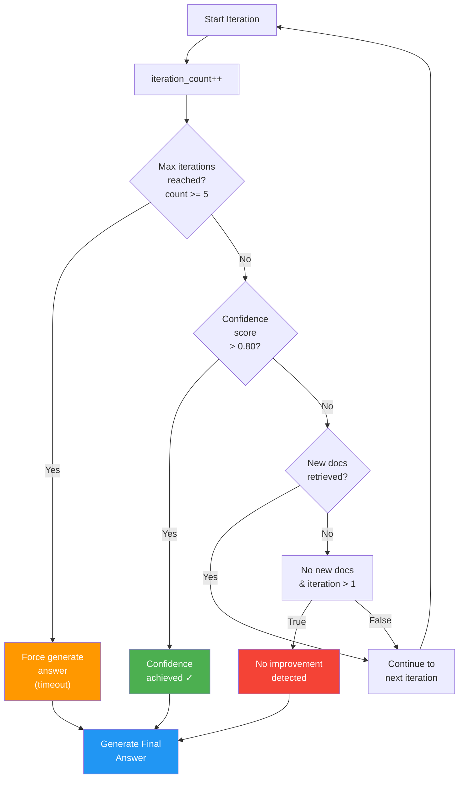
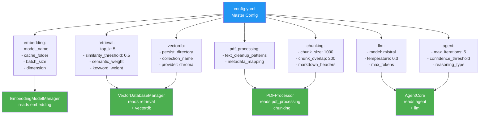

# Agentic RAG - Kiến Trúc Tổng Thể (Mermaid Diagram)

## 1. Toàn Bộ Luồng Hệ Thống (Tối Ưu cho PDF - Ngang)

### 📊 Chi Tiết Các Thành Phần:

| Thành Phần | Chức Năng |
|-----------|-----------|
| **🤖 AGENT** | Reasoning loop: Analyze query → Decide action → Execute tools → Loop until confident |
| **🔧 TOOLS** (3 công cụ) | **Retrieve**: Tìm docs từ KB; **Refine**: Sửa query; **Verify**: Kiểm tra quality |
| **🧬 Embedding** | BAAI/bge-m3 model: chuyển text → 768-dim vectors |
| **📦 Chroma DB** | Vector store: lưu embeddings + docs, tìm similarity |
| **🧠 LLM** | Mistral 7B: Reasoning, generating answers, answering queries |
| **⚙️ Config** | YAML: Quản lý tất cả settings (model, paths, thresholds) |
| **✅ Answer** | Output cuối cùng: Answer + Sources + Confidence score |

---

## 2. Agent Reasoning Loop (Tối Ưu cho PDF - Hình Chữ Nhật)

### 📋 Giải Thích Chức Năng Các Node:

| Node | Chức Năng | Chi Tiết |
|------|-----------|----------|
| **🧠 LLM REASONING** | Subgraph chứa THINK + DECIDE (gọi LLM) | Mistral 7B xử lý reasoning logic |
| **💭 THINK** | LLM phân tích tài liệu, lập kế hoạch | Nhập: docs hiện có, query; Xuất: suy luận, plan hành động |
| **🎯 DECIDE** | LLM chọn 1 trong 4 actions | Dựa trên suy luận từ THINK |
| **🔧 ACTION TOOLS** | Subgraph gồm 3 công cụ chính | Được gọi theo quyết định từ DECIDE |
| **🔍 Retrieve** | Embed query → Tìm docs từ Chroma | Action 1: Tìm kiếm tài liệu |
| **✏️ Refine** | Tạo query thay thế | Action 2: Cải thiện query nếu cần |
| **✓ Verify** | Đánh giá confidence score | Action 3: Kiểm tra chất lượng answer |
| **🧬 EMBEDDING & RETRIEVAL** | Subgraph: Embedding Model + Chroma DB | Được gọi từ Retrieve tool |
| **🧠 UPDATE STATE** | Lưu docs, track iteration history | Cập nhật state sau mỗi action |
| **✓ CHECK** | Kiểm tra điều kiện dừng | Nếu confidence > 0.8 → GENERATE; Else → THINK |
| **📊 GENERATE** | Tổng hợp docs, tạo answer cuối | Gọi LLM tạo answer final |

**Loop Logic:**
- START → THINK (gọi LLM)
- THINK → DECIDE (gọi LLM chọn action)
- DECIDE → Chọn 1 trong 4 Actions
  - Action 1 (Retrieve) → gọi Embedding + Chroma
  - Action 2 (Refine) → tạo query mới → gọi lại Retrieve
  - Action 3 (Verify) → gọi LLM check quality
  - Action 4 (Generate) → tạo final answer
- UPDATE STATE → lưu kết quả
- CHECK → (No) → quay THINK | (Yes) → GENERATE

---

## 3. Data Flow: Query → Retrieval → Answer

```mermaid
graph LR
    subgraph PHASE1["Phase 1: Query Processing"]
        Q1["Student Query"]
        Q2["Embed Query<br/>BAAI/bge-m3"]
        Q3["Query Vector<br/>768-dim"]
    end
    
    subgraph PHASE2["Phase 2: Retrieval"]
        R1["Search in Chroma<br/>similarity_search_with_score"]
        R2["Get top-K candidates<br/>k=5"]
        R3["Filter by threshold<br/>score > 0.5"]
        R4["Retrieved Documents<br/>+ Similarity Scores"]
    end
    
    subgraph PHASE3["Phase 3: Agent Reasoning"]
        A1["Agent Process:"]
        A2["- Extract key facts"]
        A3["- Combine information"]
        A4["- Check gaps"]
        A5["Decide: Need more<br/>or Ready to answer?"]
    end
    
    subgraph PHASE4["Phase 4: LLM Generation"]
        G1["Feed context to Mistral"]
        G2["System Prompt: You are<br/>regulation expert..."]
        G3["Context: [Retrieved docs]"]
        G4["Generate Answer<br/>with reasoning"]
        G5["Final Answer<br/>with sources cited"]
    end
    
    Q1 --> Q2
    Q2 --> Q3
    Q3 --> R1
    R1 --> R2
    R2 --> R3
    R3 --> R4
    R4 --> A1
    A1 --> A2
    A2 --> A3
    A3 --> A4
    A4 --> A5
    A5 -->|Need More| R1
    A5 -->|Ready| G1
    G1 --> G2
    G2 --> G3
    G3 --> G4
    G4 --> G5
    
    style PHASE1 fill:#e3f2fd
    style PHASE2 fill:#f3e5f5
    style PHASE3 fill:#fff9c4
    style PHASE4 fill:#e8f5e9
```

---

## 4. Component Architecture

---

## 5. Iteration Control & Termination

---

## 6. Query Example: Complex Regulation Question

```mermaid
graph LR
    Q["Q: 'Nếu tôi chưa đạt GPA 2.0<br/>sau 2 năm, quy định gì?<br/>Có thể hoãn học?'"]
    
    I1["🔄 Iteration 1<br/>Thought: Need GPA policy<br/>& deferment info<br/>Action: RETRIEVE<br/>Query: GPA 2.0"]
    
    D1["Docs: GPA Policy<br/>but no deferment"]
    
    I2["🔄 Iteration 2<br/>Thought: Found GPA,<br/>but deferment missing<br/>Action: RETRIEVE<br/>Query: 'hoãn học'"]
    
    D2["Docs: Deferment<br/>Policy found ✓"]
    
    I3["🔄 Iteration 3<br/>Thought: Have both infos<br/>Confidence: 0.88<br/>Action: ANSWER"]
    
    GEN["Generate with Mistral<br/>Context: [GPA docs +<br/>Deferment docs]"]
    
    ANS["Answer: 'Yes, you can<br/>defer up to 1 year.<br/>GPA < 2.0 prevents<br/>normal continuation,<br/>but deferment available<br/>per Section 5.'<br/>Sources: Sec 3, Sec 5"]
    
    Q --> I1
    I1 --> D1
    D1 --> I2
    I2 --> D2
    D2 --> I3
    I3 --> GEN
    GEN --> ANS
    
    style Q fill:#e3f2fd
    style I1 fill:#fff9c4
    style I2 fill:#fff9c4
    style I3 fill:#fff9c4
    style ANS fill:#c8e6c9
```

---

## 7. System Configuration Flow

---

## 📋 Chú Thích

- **🤖 Agent**: Quyết định what to do next dựa trên LLM reasoning
- **🔄 Iteration Loop**: Tối đa 5 vòng, dừng khi confident hoặc hết vòng
- **🔍 Retriever**: Lấy top-K documents từ Chroma vector store
- **✏️ Refiner**: Tạo query synonyms nếu cần tìm lại
- **✓ Verifier**: Kiểm tra confidence score của answer
- **📦 Chroma DB**: Vector database lưu embeddings của tất cả chunks
- **🧬 BAAI/bge-m3**: Multilingual embedding model 768-dim
- **🔌 Mistral 7B**: Local LLM via Ollama, không qua cloud

---

## 🎯 Key Features

✅ **Multi-iteration reasoning** - Agent tự refine query nếu cần  
✅ **Confidence-based** - Dừng khi confidence > 0.80  
✅ **Tool-based** - Modular tools (retrieve, refine, verify, extract)  
✅ **Config-driven** - Tất cả settings từ config.yaml  
✅ **Local & Private** - Ollama + Chroma, no cloud APIs  
✅ **Source attribution** - Trả lại source của mỗi answer
