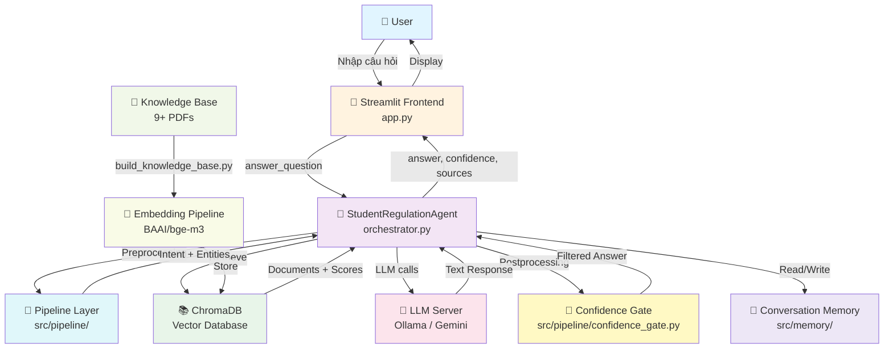
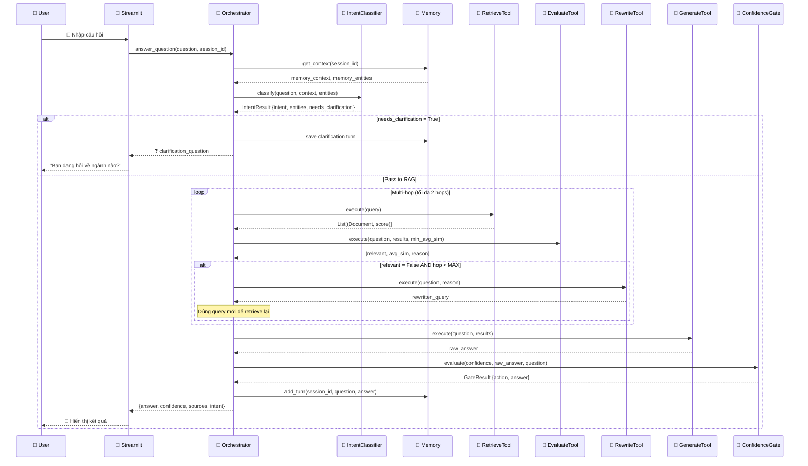
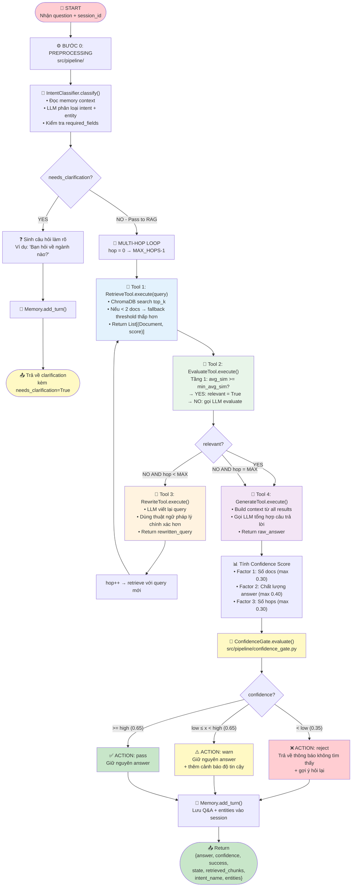
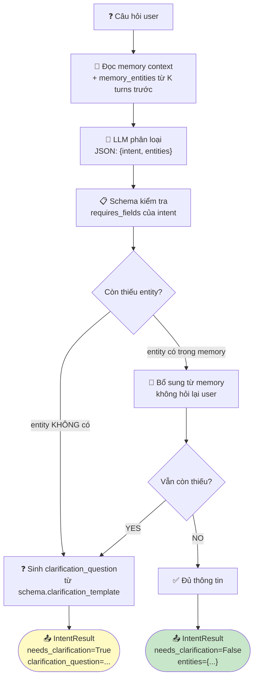
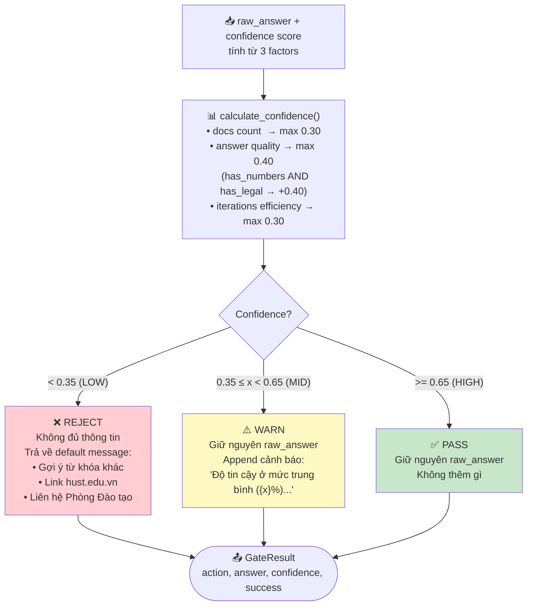
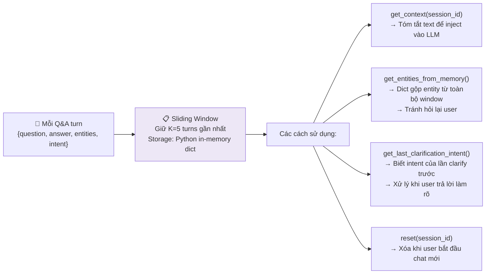
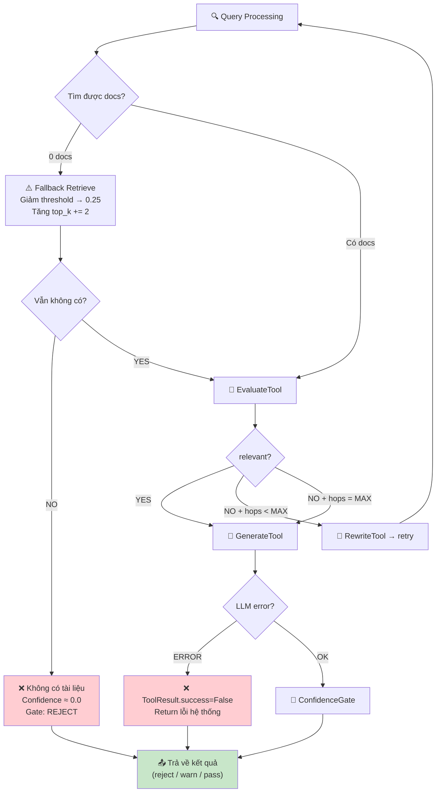
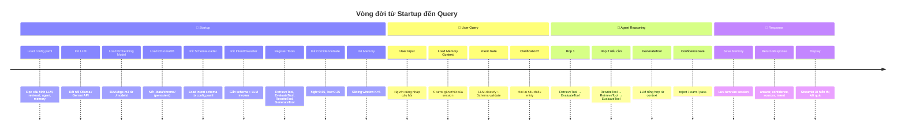

# 📊 HUST AgenticRAG Chatbot — Sơ Đồ Luồng Hoạt Động (v6)

> Kiến trúc **Tool-Based Modular** với 3 tầng rõ ràng:
> **Preprocessing (Pipeline)** → **Agent Reasoning (Tools)** → **Postprocessing (Pipeline)**

---

## 1️⃣ **SƠ ĐỒ TỔNG THỂ (HIGH-LEVEL ARCHITECTURE)**

---

## 2️⃣ **LUỒNG XỬ LÝ CHÍNH (MAIN FLOW)**

---

## 3️⃣ **LUỒNG AGENT REASONING CHI TIẾT**

---

## 4️⃣ **CẤU TRÚC MODULE (SRC/)**

```mermaid
graph TD
    SRC["📦 src/"] --> Agent & Pipeline & Memory & Embeddings & Utils

    Agent["🤖 src/agent/\nAgent Reasoning"] --> A1["orchestrator.py\nStudentRegulationAgent"]
    Agent --> A2["state.py\nAgentState + Step"]
    Agent --> A3["prompts.py\nREACT_SYSTEM_PROMPT"]
    Agent --> ToolsDir["tools/\nBaseTool interface"]

    ToolsDir --> T1["base.py\nBaseTool ABC\nToolResult dataclass"]
    ToolsDir --> T2["retrieve_tool.py\nRetrieveTool"]
    ToolsDir --> T3["evaluate_tool.py\nEvaluateTool"]
    ToolsDir --> T4["rewrite_tool.py\nRewriteTool"]
    ToolsDir --> T5["generate_tool.py\nGenerateTool"]

    Pipeline["🔀 src/pipeline/\nPre+Postprocessing"] --> P1["intent_classifier.py\nIntentClassifier\n(hybrid LLM+Schema)"]
    Pipeline --> P2["schema_loader.py\nSchemaLoader\n(load từ YAML)"]
    Pipeline --> P3["confidence_gate.py\nConfidenceGate\n(3-level: reject/warn/pass)"]

    Memory["💾 src/memory/\nConversation Memory"] --> M1["memory_manager.py\nConversationMemory\n(Sliding Window K=5)"]

    Embeddings["🔢 src/embeddings/\nVector DB Layer"] --> E1["model.py\nEmbeddingModelManager"]
    Embeddings --> E2["vector_db.py\nVectorDatabaseManager"]
    Embeddings --> E3["processor.py\nPDFProcessor"]

    Utils["🛠️ src/utils/\nUtilities"] --> U1["config.py"]
    Utils --> U2["logger.py"]
    Utils --> U3["performance.py"]

    style Agent fill:#f3e5f5
    style ToolsDir fill:#e3f2fd
    style Pipeline fill:#e0f7fa
    style Memory fill:#ede7f6
    style Embeddings fill:#e8f5e9
    style Utils fill:#fff3e0
```

---

## 5️⃣ **CHI TIẾT INTENT GATE (PREPROCESSING)**

---

## 6️⃣ **DATA PIPELINE (PDF → CHROMADB)**

```mermaid
graph LR
    A["📁 knowledge_base/raw/\nPDF files"] -->|PDFProcessor| B["📝 Extracted Text\n+ Metadata\n{source, chapter, article}"]

    B -->|Regex cleaning\nconfig.yaml rules| C["🧹 Cleaned Text\nXóa header pháp lý\nXóa số trang..."]

    C -->|TextSplitter\nchunk_size=1000\noverlap=200| D["📑 Text Chunks\nMeta: chapter_title\narticle_title, source_file"]

    D -->|EmbeddingModel\nBAAI/bge-m3| E["🔢 Embeddings\n768-dim vectors"]

    E -->|ChromaDB| F["💾 Vector Store\n./data/chroma/\nPersistent"]

    F -->|search_similar\nquery, k, threshold| G["🔍 Top-k Results\nList[(Document, score)]"]

    G -->|RetrieveTool| H["🤖 Agent"]

    style A fill:#fff3e0
    style C fill:#e0f2f1
    style F fill:#e8f5e9
    style H fill:#f3e5f5
```

---

## 7️⃣ **CONFIDENCE GATE — 3 MỨC XỬ LÝ**

---

## 8️⃣ **CONVERSATION MEMORY — SLIDING WINDOW**

---

## 9️⃣ **SƠ ĐỒ XỬ LÝ LỖI & FALLBACK**

---

## 🔟 **BẢNG TÓM TẮT MODULES**

| Tầng | Module | File | Vai trò | Class/Function chính |
|------|--------|------|---------|----------------------|
| **Preprocessing** | `src/pipeline/` | `intent_classifier.py` | Phân loại intent + bóc tách entity | `IntentClassifier.classify()` |
| **Preprocessing** | `src/pipeline/` | `schema_loader.py` | Load schema từ YAML | `SchemaLoader.load()` |
| **Postprocessing** | `src/pipeline/` | `confidence_gate.py` | Lọc câu trả lời theo độ tin cậy | `ConfidenceGate.evaluate()` |
| **Agent** | `src/agent/` | `orchestrator.py` | Điều phối toàn bộ luồng | `StudentRegulationAgent.answer_question()` |
| **Agent** | `src/agent/` | `state.py` | Lưu trạng thái reasoning | `AgentState`, `Step` |
| **Agent** | `src/agent/` | `prompts.py` | Prompt templates | `REACT_SYSTEM_PROMPT`, `build_system_prompt()` |
| **Tools** | `src/agent/tools/` | `base.py` | Interface chuẩn | `BaseTool`, `ToolResult` |
| **Tools** | `src/agent/tools/` | `retrieve_tool.py` | ChromaDB search + fallback | `RetrieveTool.execute()` |
| **Tools** | `src/agent/tools/` | `evaluate_tool.py` | avg-sim + LLM evaluate | `EvaluateTool.execute()` |
| **Tools** | `src/agent/tools/` | `rewrite_tool.py` | LLM query rewrite | `RewriteTool.execute()` |
| **Tools** | `src/agent/tools/` | `generate_tool.py` | LLM answer synthesis | `GenerateTool.execute()` |
| **Memory** | `src/memory/` | `memory_manager.py` | Sliding window memory | `ConversationMemory`, `get_memory()` |
| **Embeddings** | `src/embeddings/` | `model.py` | Load & cache embedding model | `EmbeddingModelManager` |
| **Embeddings** | `src/embeddings/` | `vector_db.py` | ChromaDB operations | `VectorDatabaseManager.search_similar()` |
| **Embeddings** | `src/embeddings/` | `processor.py` | Extract & clean PDF | `PDFProcessor.process_pdf_file()` |
| **Frontend** | `.` | `app.py` | Streamlit UI | `load_agent()`, chat interface |
| **Config** | `.` | `config.yaml` | Tất cả tham số hệ thống | LLM, retrieval, agent, memory, intents |

---

## 1️⃣1️⃣ **VÒNG ĐỜI HỆ THỐNG (LIFECYCLE)**

---

*Sơ đồ cập nhật theo kiến trúc v6 — Tool-Based Modular Agent* 🎯
