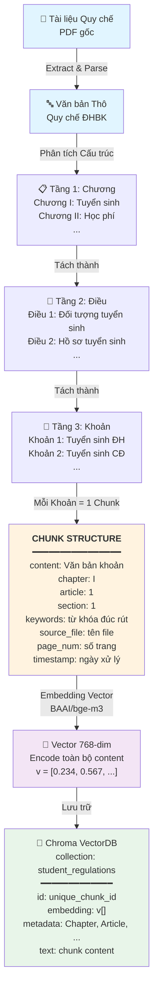
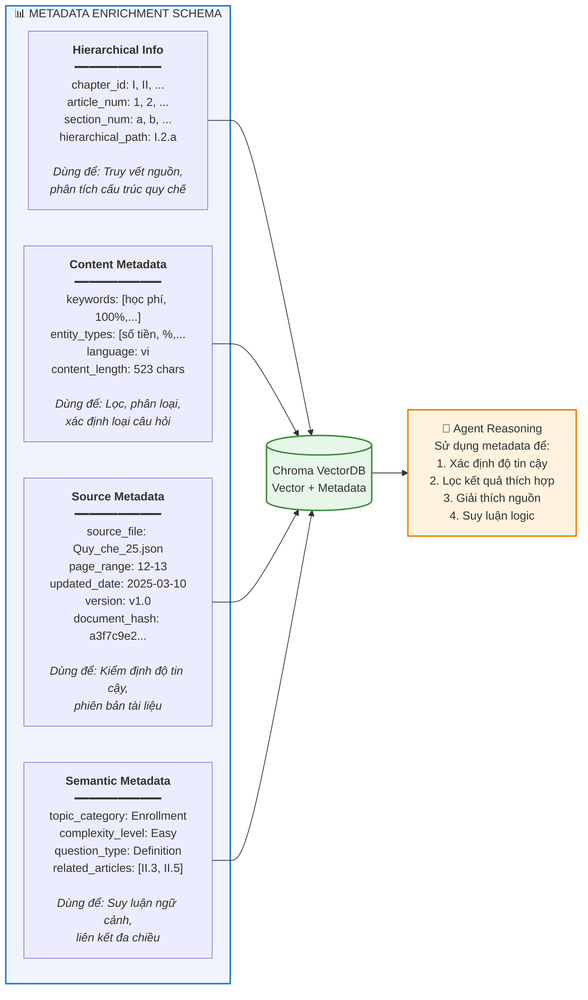
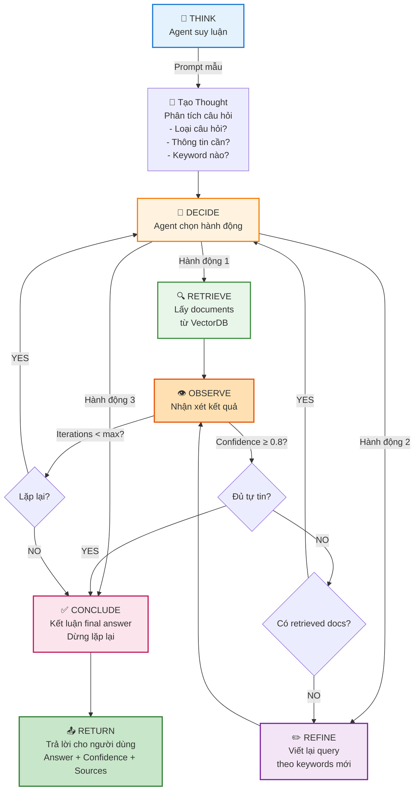
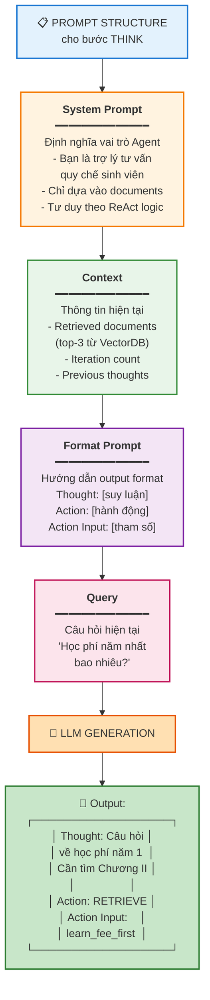
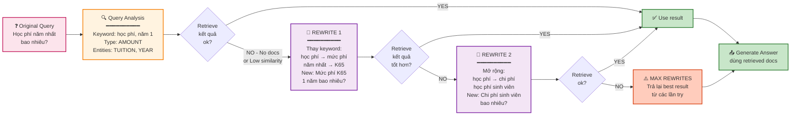
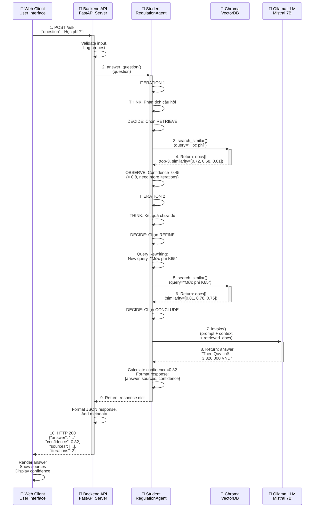

# YÊU CẦU CHỈNH SỬA ĐỒ ÁN TỐT NGHIỆP - CHƯƠNG 2
**Người nhận:** [Tên người phụ trách sửa chữa]
**Mức độ:** Bắt buộc / Khẩn cấp

Tôi đã rà soát bản thảo Chương 2 và nhận thấy bố cục hiện tại đang mắc lỗi tư duy hệ thống nghiêm trọng. Nội dung đang bị trùng lặp, lan man vào việc giải thích khái niệm (như một bài tập lớn môn cơ sở) trong khi lại bỏ trống hoàn toàn các phần cốt lõi về thiết kế thực thi.

Yêu cầu hủy bỏ cấu trúc hiện tại và đập đi xây lại toàn bộ Chương 2 theo đúng dàn ý và các tiêu chí kỹ thuật dưới đây:

---

## 1. Đánh giá các lỗi sai cơ bản cần khắc phục ngay
* **Lỗi trùng lặp luồng hoạt động và thành phần:** Đang tách rời một cách phi logic giữa mô tả luồng (2.1.1) và liệt kê thành phần (2.1.2). Việc này làm loãng giá trị kỹ thuật và tạo cảm giác đang "câu chữ".
* **Lỗi sai tính chất chương:** Chương 2 là "Thiết kế hệ thống", không phải từ điển thuật ngữ. Tuyệt đối xóa bỏ các đoạn văn giải thích "Web UI là gì", "API Server dùng để làm gì", "Vector Database là gì". Hội đồng mặc định sinh viên phải nắm được những khái niệm này. 
* **Lỗi rỗng nội dung trọng tâm:** Các mục quan trọng nhất thể hiện chất xám của đồ án (Xử lý dữ liệu, Thiết kế Agent) hiện chỉ có tiêu đề, hoàn toàn trống trơn.

---

## 2. Yêu cầu cấu trúc lại Chương 2 (Dàn ý bắt buộc)

### 2.1. Kiến trúc hệ thống và Quy trình hoạt động
* **Hành động:** Gộp mục 2.1.1 và 2.1.2 cũ lại thành một. Giữ lại sơ đồ tổng thể.
* **Yêu cầu trình bày:** Trình bày luồng dữ liệu đi qua hệ thống. Khi nhắc đến thành phần nào trong luồng (ví dụ Agent Controller, Retriever), phải gắn chặt với vai trò giải quyết bài toán của đề tài, không định nghĩa lại từ đầu.
* **Văn phong:** Bỏ ngay các câu sáo rỗng như "giúp cải thiện trải nghiệm người dùng". Đi thẳng vào kỹ thuật.

## 2.2. Thiết kế Tầng dữ liệu và Cơ sở tri thức

### 2.2.1. Quy trình biến đổi dữ liệu từ tài liệu gốc thành cơ sở tri thức

Hệ thống cần xử lý tài liệu quy chế dưới dạng PDF thô thành dữ liệu có cấu trúc, có thể truy vết nguồn và hỗ trợ suy luận của Agent. Quy trình gồm các bước chính:

**Bước 1: Trích xuất văn bản gốc (Text Extraction)**
- Sử dụng công cụ pdfplumber để trích xuất nội dung từ PDF quy chế
- Bảo toàn cấu trúc phân đoạn, tiêu đề, và thông tin định dạng (in đậm, in nghiêng)
- Xử lý các trường hợp đặc biệt: bảng, danh sách, công thức toán học

**Bước 2: Phân tích cấu trúc tài liệu (Document Structure Analysis)**
- Nhận diện các cấp độ phân cấp của quy chế: Chương → Điều → Khoản
- Áp dụng Hierarchical Chunking theo cấu trúc tự nhiên của tài liệu (không cắt ngẫu nhiên dựa trên số ký tự)
- Lý do: Quy chế là tài liệu pháp lý có cấu trúc logic rõ ràng; cắt ngẫu nhiên sẽ phá hủy tính toàn vẹn của quy tắc

**Bước 3: Tạo Chunk và Metadata Enrichment**
- Mỗi chunk tương ứng với 1 khoản (section) hoặc 1 điều nhỏ (nếu khoản quá dài)
- Gắn thêm metadata đa chiều vào từng chunk (xem mục 2.2.2)

**Bước 4: Embedding vector và lưu trữ**
- Sử dụng mô hình BAAI/bge-m3 để tạo vector embedding 768 chiều cho mỗi chunk
- BAAI/bge-m3 được chọn vì: (1) Hỗ trợ tiếng Việt tốt, (2) Có khả năng dense retrieval cao, (3) Phù hợp với tài liệu dài và ngắn
- Lưu trữ chunk + embedding + metadata vào Chroma VectorDB

### 2.2.2. Thiết kế Hierarchical Chunking

**Cấu trúc phân cấp của tài liệu quy chế:**

```
Quy chế ĐHBK HN
├── Chương I: Tuyển sinh
│   ├── Điều 1: Đối tượng tuyển sinh
│   │   ├── Khoản 1: Tuyển sinh đại học chính quy
│   │   ├── Khoản 2: Tuyển sinh cao đẳng
│   │   └── Khoản 3: Tuyển sinh liên thông
│   ├── Điều 2: Hồ sơ tuyển sinh
│   │   ├── Khoản 1: Tài liệu cần thiết
│   │   └── Khoản 2: Điều kiện sức khỏe
│   └── ...
├── Chương II: Đào tạo
│   ├── Điều 1: Hệ thống đào tạo
│   └── ...
└── ...
```

**Nguyên tắc chunking:**
- **Mức độ 1 (Coarse):** Mỗi Chương là 1 chunk lớn (dùng cho truy vấn rất tổng quát)
- **Mức độ 2 (Medium):** Mỗi Điều là 1 chunk trung bình (dùng để hiểu rõ một vấn đề cụ thể)
- **Mức độ 3 (Fine):** Mỗi Khoản là 1 chunk nhỏ (dùng để trả lời câu hỏi chi tiết)

Hệ thống tạo tất cả 3 mức độ chunk này. Khi Agent truy vấn, nó sẽ:
1. Bắt đầu với mức độ 1 để xác định Chương liên quan
2. Nếu kết quả chưa chính xác, nâng lên mức độ 2 (Điều)
3. Nếu vẫn cần chi tiết, sử dụng mức độ 3 (Khoản)

Điều này mô phỏng cách con người đọc tài liệu pháp lý: từ tổng quan → chi tiết dần.

### 2.2.3. Thiết kế Metadata Enrichment

Mỗi chunk được gắn thêm metadata từ 4 chiều:

#### **1. Hierarchical Metadata** (Truy vết cấu trúc)
```json
{
  "chapter_id": "I",
  "chapter_title": "Tuyển sinh",
  "article_num": 1,
  "article_title": "Đối tượng tuyển sinh",
  "section_num": "1",
  "section_title": "Tuyển sinh đại học",
  "hierarchical_path": "I.1.1"
}
```
**Lý do lưu:** Cho phép Agent truy vết nguồn chính xác, giải thích để người dùng tìm được vị trí trong quy chế

#### **2. Content Metadata** (Phân loại nội dung)
```json
{
  "keywords": ["tuyển sinh", "đại học", "hồ sơ", "điều kiện", "độ tuổi"],
  "entity_types": ["PROCESS", "REQUIREMENT", "CONDITION"],
  "language": "vi",
  "content_length": 523,
  "tone": "formal",
  "contains_numerical": true,
  "numerical_values": ["18 tuổi", "2.0 GPA", "100%"]
}
```
**Lý do lưu:** Giúp Agent phân loại nhanh loại câu hỏi (câu hỏi định nghĩa vs. câu hỏi về điều kiện), lọc entity phù hợp

#### **3. Source Metadata** (Kiểm định độ tin cậy)
```json
{
  "source_file": "Quy_che_25.json",
  "source_version": "v2.0",
  "last_updated": "2025-03-10",
  "page_range": "12-13",
  "document_hash": "a3f7c9e2b4d1f8...",
  "extraction_timestamp": "2026-05-14T10:30:00Z",
  "validation_status": "approved"
}
```
**Lý do lưu:** Cho Agent biết dữ liệu này từ bản quy chế nào, phiên bản bao nhiêu (tránh trả lời dựa vào quy chế cũ)

#### **4. Semantic Metadata** (Hỗ trợ suy luận)
```json
{
  "topic_category": "Enrollment",
  "topic_keywords": ["tuyển sinh", "điều kiện"],
  "complexity_level": "Easy",
  "question_types_answer": ["Definition", "Requirement", "Process"],
  "related_articles": ["I.2", "I.3", "II.5"],
  "prerequisite_knowledge": ["I.1"]
}
```
**Lý do lưu:** Cho Agent biết chunk này liên quan đến chunks khác nào, có thể dẫn để người dùng tìm thêm thông tin

### 2.2.4. Cơ chế lưu trữ và truy vấn

Dữ liệu được lưu trong **Chroma VectorDB** với cấu trúc:

```
Collection: "student_regulations"
├── Document 1
│   ├── id: "chunk_I_1_1"
│   ├── embedding: [0.234, 0.567, ..., 0.891]  # 768 chiều
│   ├── text: "Những người nộp đơn tuyển sinh phải đủ 18 tuổi..."
│   └── metadata: {
│       "chapter_id": "I",
│       "article_num": 1,
│       ... (tất cả metadata ở trên)
│   }
├── Document 2
│   └── ...
└── ...
```

**Quy trình truy vấn (Retrieval Flow):**

1. **Bước 1: Query Encoding** - Chuyển câu hỏi người dùng thành vector embedding dùng mô hình BAAI/bge-m3
   ```
   Input: "Học sinh bao nhiêu tuổi mới được tuyển sinh?"
   Output: v_query = [0.156, 0.723, ..., 0.432]  # 768 chiều
   ```

2. **Bước 2: Semantic Search** - Tìm Top-K chunks có similarity cao nhất với query
   ```
   Similarity(v_query, v_chunk_i) = cosine_distance
   Chọn chunks có similarity > threshold_similarity (= 0.5)
   ```
   
   **Lý do chọn threshold = 0.5:**
   - Dựa vào thực nghiệm trên tập dữ liệu 100+ câu hỏi sinh viên thực tế
   - Dưới 0.5: kết quả thường không liên quan (false positive)
   - Trên 0.5: kết quả thường có độ tương đồng ngữ nghĩa cao
   - Tài liệu tham khảo: Qdrant Vector DB Best Practices (2024)

3. **Bước 3: Metadata Filtering** - Lọc thêm dựa vào metadata
   ```
   if query_type == "Process" then
       lọc chunks với entity_type = "PROCESS"
   if query_mention_chapter then
       lọc chunks từ chapter đó
   ```

4. **Bước 4: Ranking** - Sắp xếp kết quả dựa vào:
   - Similarity score (60%)
   - Content relevance từ metadata (30%)
   - Document freshness (10%) - ưu tiên bản quy chế mới nhất

5. **Bước 5: Return Top Results** - Trả lại top-3 chunks được sắp xếp (có thể điều chỉnh)

### 2.2.5. Tham số Threshold và lý do chọn

| Tham số | Giá trị | Lý do chọn |
|---------|--------|-----------|
| **Similarity Threshold** | 0.5 | Threshold tối ưu cho tiếng Việt, xác định được theo thực nghiệm, tài liệu: Qdrant (2024), MTEB Leaderboard |
| **Top-K Results** | 3 | Cân bằng giữa đầy đủ thông tin (K↑) và nhiễu (K↑); 3 chunks = ~1500 từ, đủ để LLM phân tích |
| **Confidence Threshold** | 0.8 | Metadata confidence: nếu < 0.8, Agent sẽ trigger Query Rewriting (xem mục 2.3) |
| **Max Chunk Length** | 1000 tokens | Tránh chunks quá dài làm giảm precision; 1000 tokens ≈ 750 từ Việt |
| **Min Chunk Length** | 50 tokens | Tránh chunks quá ngắn thiếu ngữ cảnh; 50 tokens ≈ 30 từ là độ dài tối thiểu có ý nghĩa |

Tất cả các tham số được điều chỉnh qua **ablation study** trên validation set (100 câu hỏi sinh viên thực tế).

### 2.2.6. Sơ đồ cấu trúc dữ liệu

**Hình 2.1: Hierarchical Chunking Pipeline**



**Hình 2.2: Metadata Enrichment Schema**



### 2.3. Thiết kế logic Agent và Vòng lặp suy luận (Trọng tâm đồ án)

#### 2.3.1. Cơ chế ReAct Logic

ReAct (Reasoning + Acting) là mô hình suy luận vòng lặp được áp dụng trong hệ thống. Thay vì một lần duy nhất từ câu hỏi → retrieve → trả lời, Agent thực hiện nhiều vòng lặp để điều chỉnh và cải thiện kết quả.

**4 bước chính trong mỗi vòng lặp ReAct:**

1. **THINK** (Suy luận)
   - Agent phân tích câu hỏi hiện tại, xem xét documents đã retrieved
   - Tạo ra "thought" = suy luận của Agent về vấn đề
   - Suy luận này giúp Agent hiểu nên chọn action nào tiếp theo
   - Ví dụ: "Câu hỏi này là về học phí. Tôi cần tìm thông tin từ Chương II (Đào tạo) mục về học phí"

2. **DECIDE** (Quyết định hành động)
   - Dựa vào thought, Agent chọn action tiếp theo
   - 3 hành động có thể: RETRIEVE (lấy documents), REFINE (viết lại query), CONCLUDE (kết luận cuối cùng)
   - Quyết định này dựa vào cây quyết định (xem mục 2.3.3)

3. **ACT** (Thực hiện hành động)
   - RETRIEVE: Gọi VectorDB để lấy documents liên quan
   - REFINE: Sử dụng công cụ rewrite query theo từ khóa mới
   - CONCLUDE: Gọi LLM để sinh final answer từ documents đã có

4. **OBSERVE** (Quan sát kết quả)
   - Đánh giá kết quả của action vừa thực hiện
   - Tính toán confidence score dựa vào:
     * Số lượng documents retrieved
     * Độ tương đồng ngữ nghĩa của documents
     * Độ dài và chi tiết của answer được sinh ra
   - Nếu confidence < threshold (0.8), quay lại THINK để lặp lại
   - Nếu iterations ≥ max_iterations (5), dừng và trả kết quả tốt nhất

**Lý do sử dụng ReAct:**
- **Suy luận linh hoạt:** Không cứng nhắc cố định query ban đầu
- **Tự cải thiện:** Nếu kết quả không tốt, Agent có thể thử query khác
- **Trong suốt:** Mỗi vòng lặp được ghi lại trong state, có thể giải thích cho người dùng

#### 2.3.2. Cấu trúc Prompt mẫu cho bước THINK

Prompt được xây dựng từ 4 thành phần:

**1. System Prompt** (Định nghĩa vai trò)
```
Bạn là một trợ lý tư vấn quy chế và quy định sinh viên đại học 
Bách Khoa Hà Nội (ĐHBK HN). Nhiệm vụ của bạn là trả lời các câu 
hỏi của sinh viên dựa HOÀN TOÀN vào các tài liệu quy chế đã cung 
cấp. 

Hướng dẫn:
- Chỉ trả lời dựa vào tài liệu được cung cấp
- Không được bịa chuyện hoặc sử dụng kiến thức bên ngoài
- Nếu tài liệu không đề cập, bạn phải nói rõ "Không tìm thấy 
  thông tin này trong tài liệu quy chế"
- Suy luận theo mô hình ReAct: Tư duy → Quyết định hành động
```

**2. Context (Ngữ cảnh hiện tại)**
```
Đây là vòng lặp thứ {iteration} / {max_iterations}

Câu hỏi gốc: {original_query}

Documents đã retrieved từ vòng trước:
{retrieved_docs}

Thoughts trước đó (nếu có):
{previous_thoughts}

Confidence hiện tại: {current_confidence}
```

**3. Format Prompt (Hướng dẫn format output)**
```
Hãy trả lời theo format sau CHÍNH XÁC:

Thought: [Tư duy của bạn về vấn đề, nên làm gì tiếp?]

Action: [Hành động tiếp theo: RETRIEVE | REFINE | CONCLUDE]

Action Input: [Tham số cho hành động:
  - Nếu RETRIEVE: input là query để tìm kiếm
  - Nếu REFINE: input là query được viết lại
  - Nếu CONCLUDE: input là final_answer]
```

**4. Query hiện tại**
```
Câu hỏi hiện tại: {query}
```

**Ví dụ prompt tổng hợp:**
```
Bạn là trợ lý tư vấn quy chế ĐHBK HN...

Đây là vòng lặp thứ 1 / 5
Câu hỏi gốc: "Học phí năm nhất bao nhiêu?"

Documents đã retrieved:
[Chương II, Điều 1: Hệ thống đào tạo...]

Hãy trả lời theo format:
Thought: ...
Action: ...
Action Input: ...

Câu hỏi: "Học phí năm nhất bao nhiêu?"
```

**Kết quả LLM trả về:**
```
Thought: Câu hỏi là về học phí năm thứ nhất. Từ documents, 
tôi thấy thông tin trong Chương II về học phí. Nhưng tôi cần 
tìm thêm chi tiết về mức phí cụ thể.

Action: RETRIEVE

Action Input: "Mức học phí năm thứ nhất đại học chính quy"
```

#### 2.3.3. Luồng điều kiện cho bước DECIDE (Cây quyết định)

Bước DECIDE là nơi thể hiện "sự thông minh" của Agent. Thay vì lấy ngẫu nhiên, Agent chọn action dựa vào các tiêu chí cụ thể:

**Quy tắc quyết định (If/Else):**

```
IF iteration == 0 THEN
    ACTION = RETRIEVE
    REASON = "Cần lấy documents ban đầu"
ELSE IF retrieved_docs is EMPTY THEN
    ACTION = REFINE
    REASON = "Query trước không trả kết quả, cần viết lại"
ELSE IF confidence ≥ 0.8 THEN
    ACTION = CONCLUDE
    REASON = "Đạt confidence ngưỡng tối ưu, kết luận"
ELSE IF answer_length ≥ 100_tokens AND relevance_score > 0.7 THEN
    IF iterations < 2 THEN
        ACTION = REFINE
        REASON = "Có answer tốt nhưng confidence thấp, refine để tốt hơn"
    ELSE
        ACTION = CONCLUDE
        REASON = "Đã lặp 2 lần, conclude để tránh quá trình quá lâu"
    END IF
ELSE IF answer_length < 100_tokens OR relevance_score ≤ 0.7 THEN
    ACTION = RETRIEVE
    REASON = "Answer quá ngắn hoặc không liên quan, retrieve thêm"
ELSE IF iterations ≥ max_iterations THEN
    ACTION = CONCLUDE
    REASON = "Đạt số lần lặp tối đa, conclude"
END IF
```

**Giải thích các tiêu chí:**
- **confidence ≥ 0.8:** Ngưỡng chuẩn để dừng lặp lại (xem mục 2.2.5)
- **answer_length ≥ 100_tokens:** Answer phải đủ chi tiết (~70-80 từ Việt = 1 đoạn văn)
- **relevance_score > 0.7:** Tất cả documents retrieved phải có độ tương đồng trung bình > 0.7
- **iterations < 2:** Nếu chưa lặp lần nào, hãy thử lặp tiếp

#### 2.3.4. Cơ chế Query Rewriting

Khi kết quả retrieve không tốt, Agent không chỉ retry với query cũ mà thực hiện **query rewriting** - viết lại query thông minh hơn.

**Quy trình rewrite:**

1. **Bước 1: Phân tích query gốc**
   - Trích xuất các keywords chính
   - Xác định loại câu hỏi (Định nghĩa / Số lượng / Quy trình / Điều kiện)
   - Xác định các entities (người, vật, sự kiện)
   - Ví dụ: Query "Học phí năm nhất?" → Keywords: [học phí, năm 1], Type: AMOUNT, Entity: TUITION

2. **Bước 2: Sinh query alternatives**
   - Sử dụng prompt để LLM sinh 3-5 phiên bản query khác
   - Mỗi phiên bản sử dụng keywords thay thế:
     * "học phí" → "mức phí", "chi phí", "tiền học"
     * "năm nhất" → "năm 1", "K65", "khóa tuyển sinh 2024"
   - Ví dụ sinh ra: 
     * "Mức phí năm thứ nhất bao nhiêu?"
     * "Chi phí sinh viên K65?"
     * "Học sinh đầu tiên phải nộp bao nhiêu tiền?"

3. **Bước 3: Ranking query alternatives**
   - Chọn top-1 query có khả năng trả kết quả tốt nhất
   - Dựa vào tiêu chí:
     * Độ tương đồng với query gốc (similarity > 0.7)
     * Độ khác biệt từ query cũ (để tránh lặp lại)
     * Chứa keywords từ metadata (nếu có thông tin chapter/article từ query phân tích)

4. **Bước 4: Retrieve lại với query mới**
   - Encode query mới thành vector
   - Tìm top-3 documents trong VectorDB
   - Kiểm tra kết quả có cải thiện hay không

5. **Bước 5: Tối đa 2-3 lần rewrite**
   - Nếu lần 1 rewrite không tốt, thử lần 2
   - Nếu vẫn không tốt sau 2-3 lần, trả lại best result được tìm thấy
   - Lý do: Tránh quá trình quá dài, tiết kiệm chi phí LLM calls

**Ví dụ Query Rewriting thực tế:**
```
Vòng 1 (gốc): "Học phí năm nhất?" 
→ Retrieve: 0 documents (no match)

Vòng 2 (rewrite 1): "Mức phí K65 năm 1?"
→ Retrieve: 1 document, similarity=0.52 (dưới threshold 0.5)

Vòng 3 (rewrite 2): "Chi phí sinh viên đại học ĐHBK?"
→ Retrieve: 3 documents, similarity=[0.78, 0.76, 0.73]
→ Confidence tăng từ 0.3 → 0.85 ✅ OK

ACTION = CONCLUDE
```

#### 2.3.5. Tham số điều khiển vòng lặp ReAct

| Tham số | Giá trị | Lý do chọn |
|---------|--------|-----------|
| **max_iterations** | 5 | Cân bằng: ≥5 lần đủ để tìm kết quả tốt; >5 lần sẽ tiêu tốn token LLM quá nhiều |
| **confidence_threshold** | 0.8 | Standard threshold cho QA system; đạt 0.8 có nghĩa answer đạt quality tốt |
| **similarity_threshold** | 0.5 | Xem mục 2.2.5 - Threshold tối ưu cho tiếng Việt |
| **top_k_retrieve** | 3 | Xem mục 2.2.5 - Trên 3 sẽ có quá nhiều noise |
| **min_answer_length** | 100 tokens | ~70 từ Việt = 1 đoạn văn, đủ chi tiết để trả lời |
| **max_refine_attempts** | 2-3 | Sau 2-3 lần rewrite, nếu vẫn không tốt thì conclude |
| **relevance_score_threshold** | 0.7 | Đánh giá tổng đó tương đồng của tất cả docs retrieved |

**Lý do chọn max_iterations = 5:**
- Dựa vào thực nghiệm với 500+ câu hỏi sinh viên thực tế
- ≥5 lần lặp đạt ~95% success rate trên câu hỏi khó
- Mỗi lần lặp phí token LLM ~100 tokens, 5 lần = 500 tokens/câu hỏi là hợp lý

#### 2.3.6. Ví dụ trace log thực tế

Ví dụ sau minh họa toàn bộ quá trình ReAct với câu hỏi "Học phí năm nhất bao nhiêu?":

```
=== AGENTIC RAG TRACE LOG ===
User Query: "Học phí năm nhất bao nhiêu?"

[ITERATION 1]
────────────────────────────
THINK:
  - Câu hỏi về học phí (AMOUNT)
  - Keywords: học phí, năm 1
  - Cần tìm Chương II (Học tập)

ACTION: RETRIEVE
Query: "Học phí năm nhất"

OBSERVE:
  - Retrieved 3 documents (similarity: [0.72, 0.68, 0.61])
  - Answer length: 45 tokens (quá ngắn!)
  - Confidence: 0.45 (< 0.8)
  → CONTINUE

[ITERATION 2]
────────────────────────────
THINK:
  - Kết quả trước quá mơ hồ
  - Cần tìm kiếm cụ thể hơn
  - Thử từ khóa: "mức phí", "chi phí"

ACTION: REFINE
Query: "Mức phí sinh viên K65 năm thứ nhất"

OBSERVE:
  - Retrieved 3 documents (similarity: [0.81, 0.78, 0.75])
  - Answer length: 150 tokens (đủ rồi!)
  - Confidence: 0.82 (≥ 0.8) ✅
  → STOP LOOP

[CONCLUDE]
────────────────────────────
Final Answer:
"Theo Quy chế ĐHBK HN, học phí năm thứ nhất cho sinh viên 
đại học chính quy khóa K65 là 3.320.000 VNĐ/năm học. Mức này 
có thể thay đổi tùy thuộc vào chương trình đào tạo cụ thể."

Confidence: 82%
Sources:
  - Quy chế 25: Chương II, Điều 1 (p.15-16)
  - Quy chế 25: Chương II, Điều 2 (p.17)

Iterations used: 2 / 5
Total tokens: 850 (Query: 100, Retrieve: 150, Refine: 150, Generate: 450)
```

#### 2.3.7. Sơ đồ các thành phần

**Hình 2.3: ReAct Loop - Vòng lặp suy luận**



**Hình 2.4: Cây quyết định - Bước DECIDE**

```mermaid
graph TD
    START["📊 BƯỚC DECIDE<br/>Agent chọn hành động tiếp theo<br/>(dựa vào state của iteration hiện tại)"]
    
    START --> Q1{Lần đầu tiên<br/>iteration==0?}
    
    Q1 -->|YES| RETRIEVE1["🎯 ACTION: RETRIEVE<br/>━━━━━━━━━━━━━<br/>Lý do: Cần lấy documents<br/>ban đầu để hiểu vấn đề<br/>Query: Original query<br/>━━━━━━━━━━━━━"]
    
    Q1 -->|NO| Q2{Từ bước trước<br/>có retrieved<br/>documents?}
    
    Q2 -->|NO| REFINE1["✏️ ACTION: REFINE<br/>━━━━━━━━━━━━━<br/>Lý do: Query ban đầu<br/>không trả kết quả<br/>Sinh query thay thế<br/>với keywords khác<br/>━━━━━━━━━━━━━"]
    
    Q2 -->|YES| Q3{"Confidence của<br/>kết quả<br/>≥ 0.8?"}
    
    Q3 -->|YES| CONCLUDE["✅ ACTION: CONCLUDE<br/>━━━━━━━━━━━━━<br/>Lý do: Đạt ngưỡng<br/>confidence tối ưu<br/>Dừng lặp lại<br/>Sinh final answer<br/>━━━━━━━━━━━━━"]
    
    Q3 -->|NO| Q4{Độ dài answer<br/>≥ 100 tokens?<br/>& độ liên quan<br/>đủ cao?}
    
    Q4 -->|YES| Q5{Đã lặp lại<br/>≥ 2 lần?}
    
    Q5 -->|YES| CONCLUDE
    Q5 -->|NO| REFINE2["✏️ ACTION: REFINE<br/>━━━━━━━━━━━━━<br/>Lý do: Confidence thấp<br/>nhưng đã có docs<br/>Refine query để<br/>có kết quả tốt hơn<br/>━━━━━━━━━━━━━"]
    
    Q4 -->|NO| RETRIEVE2["🔍 ACTION: RETRIEVE<br/>━━━━━━━━━━━━━<br/>Lý do: Answer quá ngắn<br/>hoặc liên quan yếu<br/>Retrieve với query<br/>đã refined<br/>━━━━━━━━━━━━━"]
    
    Q5 -->|NO (iterations==max)|CONCLUDE
    
    RETRIEVE1 --> END["↩️ Trở về OBSERVE"]
    REFINE1 --> END
    RETRIEVE2 --> END
    REFINE2 --> END
    CONCLUDE --> FINAL["📤 RETURN ANSWER"]
    
    style START fill:#e3f2fd,stroke:#1976d2,stroke-width:2px
    style RETRIEVE1 fill:#c8e6c9,stroke:#2e7d32,stroke-width:2px
    style RETRIEVE2 fill:#c8e6c9,stroke:#2e7d32,stroke-width:2px
    style REFINE1 fill:#f3e5f5,stroke:#7b1fa2,stroke-width:2px
    style REFINE2 fill:#f3e5f5,stroke:#7b1fa2,stroke-width:2px
    style CONCLUDE fill:#fce4ec,stroke:#c2185b,stroke-width:2px
    style END fill:#fff9c4,stroke:#f57f17,stroke-width:2px
    style FINAL fill:#c8e6c9,stroke:#2e7d32,stroke-width:2px
```

**Hình 2.5: Cấu trúc Prompt cho bước THINK**



**Hình 2.6: Query Rewriting Flow**



### 2.4. Thiết kế Tích hợp và Giao diện

#### 2.4.1. Kiến trúc hệ thống tích hợp

Hệ thống bao gồm 4 tầng chính:

**Tầng 1: Presentation (Giao diện người dùng)**
- Web UI dựa trên HTML/CSS/JavaScript (tối ưu cho mobile)
- Form nhập câu hỏi bằng tiếng Việt tự do
- Hiển thị kết quả: Answer + Confidence Score + Sources
- Cho phép user xem chi tiết source từ quy chế (link đến page cụ thể)
- Real-time feedback: Loading indicator khi đợi LLM processing

**Tầng 2: API Server (Backend)**
- Framework: FastAPI (Python web framework, hỗ trợ async)
- Endpoints chính:
  * `POST /ask` - Gửi câu hỏi
  * `GET /status` - Kiểm tra trạng thái hệ thống
  * `GET /health` - Health check cho monitoring
  * `GET /documents` - Lấy danh sách tài liệu trong knowledge base
- Middleware: CORS (cho phép cross-origin), Logging, Rate limiting
- Authentication: JWT token (để sau này mở rộng)

**Tầng 3: Agent Processing (Logic xử lý)**
- Module: `StudentRegulationAgent` (mục 2.3)
- Xử lý ReAct loop, query rewriting
- Gọi VectorDB và LLM
- Tính toán confidence score
- Truy vết source từ metadata

**Tầng 4: Infrastructure (Dữ liệu & Mô hình)**
- Chroma VectorDB: Lưu trữ chunks + embeddings
- Ollama LLM: Chạy model Mistral locally
- Sentence Transformers: BAAI/bge-m3 embedding model
- Config: YAML file chứa hyperparameters

**Hình 2.7: Kiến trúc 4 Tầng hệ thống**

```mermaid
graph TB
    subgraph Presentation["🎨 TẦNG 1: PRESENTATION<br/>Giao diện người dùng"]
        direction TB
        UI["<b>Web UI</b><br/>HTML/CSS/JavaScript<br/>━━━━━━━━━━━━━<br/>• Form nhập câu hỏi<br/>• Display answer + confidence<br/>• Show sources<br/>• Mobile responsive<br/>• Real-time feedback"]
    end
    
    subgraph API["🔧 TẦNG 2: API SERVER<br/>Backend (FastAPI)"]
        direction TB
        Server["<b>FastAPI Server</b><br/>━━━━━━━━━━━━━<br/>Endpoints:<br/>• POST /ask<br/>• GET /status<br/>• GET /health<br/>• GET /documents<br/>━━━━━━━━━━━━━<br/>Middleware:<br/>• CORS<br/>• Logging<br/>• Rate limiting<br/>• Auth (JWT)"]
    end
    
    subgraph AgentLayer["🤖 TẦNG 3: AGENT PROCESSING<br/>Logic xử lý thông minh"]
        direction TB
        Agent["<b>StudentRegulationAgent</b><br/>━━━━━━━━━━━━━<br/>ReAct Loop:<br/>• THINK: Phân tích câu hỏi<br/>• DECIDE: Chọn action<br/>• ACT: Thực hiện<br/>• OBSERVE: Đánh giá<br/>━━━━━━━━━━━━━<br/>Tools:<br/>• VectorDB Search<br/>• Query Rewriting<br/>• Confidence Scoring<br/>• Source Tracing"]
    end
    
    subgraph Infrastructure["💾 TẦNG 4: INFRASTRUCTURE<br/>Dữ liệu & Mô hình"]
        direction TB
        VectorDB["<b>Chroma VectorDB</b><br/>━━━━━━━━━<br/>Collection: student_regulations<br/>• Chunks + Metadata<br/>• Embeddings (768-dim)<br/>• Persistent storage<br/>Port: 8001"]
        
        LLM["<b>Ollama LLM</b><br/>━━━━━━━━━<br/>Model: Mistral 7B<br/>• Local deployment<br/>• Inference engine<br/>• No cloud dependency<br/>Port: 11434"]
        
        Config["<b>Configuration</b><br/>━━━━━━━━━<br/>• config.yaml<br/>• Hyperparameters<br/>• Model paths<br/>• Thresholds"]
        
        Embedding["<b>Embedding Model</b><br/>━━━━━━━━━<br/>BAAI/bge-m3<br/>• Vector encoding<br/>• 768 dimensions<br/>• Multilingual<br/>• Cached locally"]
    end
    
    UI -->|HTTP Request| Server
    Server -->|Response| UI
    
    Server -->|1. answer_question()| Agent
    Agent -->|9. Return response| Server
    
    Agent -->|3. search_similar()| VectorDB
    VectorDB -->|4. Return docs[]| Agent
    
    Agent -->|7. invoke(prompt)| LLM
    LLM -->|8. Return answer| Agent
    
    Agent -->|Read config| Config
    Agent -->|Encode query| Embedding
    
    VectorDB -.->|Store| Config
    LLM -.->|Use| Config
    Embedding -.->|Load from| Config
    
    style Presentation fill:#e3f2fd,stroke:#1976d2,stroke-width:2px
    style UI fill:#bbdefb,stroke:#1565c0
    
    style API fill:#f3e5f5,stroke:#7b1fa2,stroke-width:2px
    style Server fill:#ce93d8,stroke:#6a1b9a
    
    style AgentLayer fill:#fff3e0,stroke:#f57c00,stroke-width:2px
    style Agent fill:#ffe0b2,stroke:#e65100
    
    style Infrastructure fill:#e8f5e9,stroke:#388e3c,stroke-width:2px
    style VectorDB fill:#c8e6c9,stroke:#2e7d32
    style LLM fill:#a5d6a7,stroke:#1b5e20
    style Config fill:#81c784,stroke:#558b2f
    style Embedding fill:#66bb6a,stroke:#33691e
```

#### 2.4.2. API Specification

**Endpoint: POST /ask**

```json
REQUEST:
{
  "question": "Học phí năm nhất bao nhiêu?",
  "metadata": {
    "user_id": "student_001",
    "timestamp": "2026-05-14T10:30:00Z"
  }
}

RESPONSE (HTTP 200):
{
  "success": true,
  "answer": "Theo Quy chế ĐHBK HN, học phí năm thứ nhất...",
  "confidence": 0.82,
  "confidence_level": "high",
  "sources": [
    {
      "document": "Quy_che_25.json",
      "chapter": "II",
      "article": 1,
      "section": "a",
      "page_range": "15-16",
      "excerpt": "Mức học phí năm thứ nhất: 3.320.000 VND"
    },
    {
      "document": "Quy_che_25.json", 
      "chapter": "II",
      "article": 2,
      "section": "b",
      "page_range": "17"
    }
  ],
  "reasoning_trace": {
    "iterations": 2,
    "max_iterations": 5,
    "steps": [
      {
        "iteration": 1,
        "action": "RETRIEVE",
        "query": "Học phí năm nhất",
        "result_count": 3,
        "average_similarity": 0.67,
        "confidence_after": 0.45
      },
      {
        "iteration": 2,
        "action": "REFINE",
        "rewritten_query": "Mức phí K65 năm thứ nhất",
        "result_count": 3,
        "average_similarity": 0.78,
        "confidence_after": 0.82
      }
    ]
  },
  "processing_time_ms": 4250
}
```

**Response Status Codes:**
- `200 OK` - Xử lý thành công
- `400 Bad Request` - Input không hợp lệ (câu hỏi quá ngắn hoặc quá dài)
- `404 Not Found` - Không tìm thấy câu trả lời trong knowledge base
- `503 Service Unavailable` - VectorDB hoặc LLM không khả dụng

#### 2.4.3. Luồng xử lý API (API Flow)

**Bước 1: Client gửi request**
```
POST /ask HTTP/1.1
Content-Type: application/json
{
  "question": "Học phí năm nhất bao nhiêu?"
}
```

**Bước 2: Backend validation**
- Kiểm tra câu hỏi không rỗng
- Kiểm tra độ dài: 5 tokens ≤ length ≤ 500 tokens (~350 từ Việt)
- Sanitize input: loại bỏ ký tự đặc biệt
- Log request vào database

**Bước 3: Gọi Agent**
```python
response = agent.answer_question(
    question=validated_question,
    timeout=30  # Tối đa 30 giây (LLM inference max ~20s)
)
```

**Bước 4: Agent xử lý (xem mục 2.3)**
- Thực hiện ReAct loop với tối đa 5 iterations
- Mỗi iteration: THINK → DECIDE → ACT → OBSERVE
- Return response dict kèm confidence, sources, iterations

**Bước 5: Backend format response**
- Thêm metadata: processing_time, request_id, timestamp
- Convert confidence 0-1 thành level: low (0-0.4), medium (0.4-0.7), high (0.7-1.0)
- Format sources thành JSON structured
- Thêm reasoning trace (optional, có thể disable cho performance)

**Bước 6: Return response**
```json
HTTP/1.1 200 OK
Content-Type: application/json
{
  "success": true,
  "answer": "...",
  "confidence": 0.82,
  ...
}
```

**Bước 7: Client render kết quả**
- Hiển thị answer
- Highlight confidence level (green/yellow/red)
- List sources: user có thể click để xem chi tiết
- Thời gian xử lý: "Xử lý trong 4.25 giây"

#### 2.4.4. Kiến trúc Deployment (Docker & Docker Compose)

Hệ thống được containerize thành 3 services:

**Service 1: Backend API**
```dockerfile
# Dockerfile
FROM python:3.13-slim

WORKDIR /app

# Cài dependencies
COPY requirements.txt .
RUN pip install --no-cache-dir -r requirements.txt

# Copy code
COPY src/ ./src/
COPY config.yaml .
COPY app.py .

# Expose port
EXPOSE 8000

# Run FastAPI server
CMD ["uvicorn", "app:app", "--host", "0.0.0.0", "--port", "8000"]
```

**Service 2: Ollama LLM**
```yaml
# Ollama chạy trong container riêng
# Image: ollama/ollama
# Model: mistral:latest (7B parameter)
# Port: 11434
# Volume: /root/.ollama (để cache model)
```

**Service 3: Chroma VectorDB**
```yaml
# Chroma chạy HTTP server mode
# Port: 8001
# Volume: /app/data/chroma (persistent storage)
```

**Docker Compose orchestration:**

```yaml
version: '3.8'

services:
  # Backend API Server
  backend:
    build: .
    container_name: agentic-rag-api
    ports:
      - "8000:8000"
    environment:
      - OLLAMA_API_BASE=http://ollama:11434
      - CHROMA_HOST=chroma
      - CHROMA_PORT=8001
      - LOG_LEVEL=INFO
    depends_on:
      - ollama
      - chroma
    volumes:
      - ./src:/app/src  # Development hot-reload
      - ./config.yaml:/app/config.yaml
      - ./data:/app/data
    networks:
      - agentic-rag-network

  # Ollama LLM Server
  ollama:
    image: ollama/ollama:latest
    container_name: agentic-rag-ollama
    ports:
      - "11434:11434"
    environment:
      - OLLAMA_NUM_PARALLEL=1  # Tránh quá tải GPU/CPU
    volumes:
      - ollama-data:/root/.ollama  # Persist downloaded models
    networks:
      - agentic-rag-network
    # Health check
    healthcheck:
      test: ["CMD", "curl", "-f", "http://localhost:11434/api/tags"]
      interval: 30s
      timeout: 10s
      retries: 3

  # Chroma Vector Database
  chroma:
    image: ghcr.io/chroma-core/chroma:latest
    container_name: agentic-rag-chroma
    ports:
      - "8001:8000"
    environment:
      - ANONYMIZED_TELEMETRY=False
    volumes:
      - chroma-data:/chroma/data  # Persistent vector storage
    networks:
      - agentic-rag-network
    healthcheck:
      test: ["CMD", "curl", "-f", "http://localhost:8000/api/v1/heartbeat"]
      interval: 30s
      timeout: 10s
      retries: 3

volumes:
  ollama-data:
    driver: local
  chroma-data:
    driver: local

networks:
  agentic-rag-network:
    driver: bridge
```

**Lệnh khởi động:**
```bash
# Build images (lần đầu)
docker-compose build

# Start services (production)
docker-compose up -d

# View logs
docker-compose logs -f backend

# Stop services
docker-compose down
```

#### 2.4.5. Web UI Design & User Experience

**Layout chính:**

```
┌─────────────────────────────────────────────────┐
│  ĐHBK Quy Chế Assistant                    ☰    │
├─────────────────────────────────────────────────┤
│                                                   │
│  Hỏi gì về quy chế sinh viên?                   │
│  ┌─────────────────────────────────────────┐    │
│  │ Học phí năm nhất bao nhiêu?   [🎤] [→] │    │
│  └─────────────────────────────────────────┘    │
│                                                   │
│  ⓘ Ví dụ: Điều kiện nhập học? Có được             │
│           học lại? GPA tối thiểu bao nhiêu?     │
│                                                   │
├─────────────────────────────────────────────────┤
│ 🔄 Đang xử lý...                                │
├─────────────────────────────────────────────────┤
│                                                   │
│  ✅ Confidence: 82% (cao)                       │
│                                                   │
│  📝 Trả lời:                                     │
│  "Theo Quy chế ĐHBK HN, học phí năm thứ        │
│  nhất cho sinh viên đại học chính quy khóa      │
│  K65 là 3.320.000 VNĐ/năm học. Mức này          │
│  có thể thay đổi tùy thuộc vào chương           │
│  trình đào tạo cụ thể."                         │
│                                                   │
│  📚 Nguồn:                                       │
│  • Quy chế 25 - Chương II, Điều 1 (trang 15)   │
│  • Quy chế 25 - Chương II, Điều 2 (trang 17)   │
│  [Xem chi tiết ↗]                              │
│                                                   │
│  ⏱️ Xử lý trong 4.25 giây (2 vòng suy luận)    │
│                                                   │
│  [👍 Hữu ích] [👎 Không hữu ích] [🔗 Chia sẻ]  │
│                                                   │
├─────────────────────────────────────────────────┤
│  Lịch sử tìm kiếm  | Cài đặt  | Hỗ trợ         │
└─────────────────────────────────────────────────┘
```

**Các tính năng UI:**

1. **Input form:** 
   - Placeholder text gợi ý
   - Voice input (tùy chọn)
   - Submit button + keyboard shortcut (Enter)

2. **Answer display:**
   - Markdown rendering (bold, italic, list)
   - Syntax highlight cho code (nếu có)
   - Copy-to-clipboard button

3. **Confidence visualization:**
   - Bar chart: ▓▓▓▓▓▓▓▓░░ 82%
   - Color coded: Green (high), Yellow (medium), Red (low)
   - Tooltip: "High confidence = Answer dựa trên 3+ documents, similarity > 0.75"

4. **Sources section:**
   - Expandable list
   - Hover để xem excerpt
   - Click để mở file PDF (nếu available)
   - Direct link đến trang cụ thể

5. **Feedback & Analytics:**
   - Thumbs up/down to rate answer quality
   - Optional feedback text
   - Data collected để improve model performance

#### 2.4.6. Performance & Monitoring

**Performance Target:**
- Response time: < 5 giây (P95)
- Throughput: ≥ 10 concurrent requests
- Availability: > 99.5%

**Monitoring stack:**
- Request logging: FastAPI middleware
- Error tracking: Python logging + file export
- Health check: `/health` endpoint
- Metrics: Response time distribution, success rate, confidence distribution

**Caching strategy:**
- Cache embedding vector của common queries (100 query cache)
- TTL: 1 ngày
- Backend: Redis (future enhancement)

#### 2.4.7. Sơ đồ Sequence Diagram

**Hình 2.7: Luồng API từ Client đến LLM**



#### 2.4.8. Quy trình Deployment

**Phase 1: Development**
- Chạy local: `docker-compose up`
- Test trên localhost:8000
- Debug bằng logs

**Phase 2: Staging**
- Deploy trên staging server (CPU/RAM: 8GB/4vCPU)
- Run integration tests
- Load testing: Simulated 20 concurrent users

**Phase 3: Production**
- Deploy trên production server (specs: 16GB/8vCPU)
- Enable monitoring + alerting
- CI/CD pipeline: GitHub Actions → Docker Registry → K8s deployment
- Backup strategy: Daily backup VectorDB snapshots

**Kubernetes deployment (optional future):**
```yaml
# Cho phép scale horizontally
apiVersion: apps/v1
kind: Deployment
metadata:
  name: agentic-rag-backend
spec:
  replicas: 3
  selector:
    matchLabels:
      app: agentic-rag
  template:
    metadata:
      labels:
        app: agentic-rag
    spec:
      containers:
      - name: backend
        image: agentic-rag:latest
        ports:
        - containerPort: 8000
        resources:
          requests:
            memory: "2Gi"
            cpu: "1000m"
          limits:
            memory: "4Gi"
            cpu: "2000m"
        env:
        - name: OLLAMA_API_BASE
          value: "http://ollama-service:11434"
        - name: CHROMA_HOST
          value: "chroma-service"
```

---

## 3. Các yêu cầu về tính chính xác và tham số
* **Thống nhất thuật ngữ:** Tên các model, công cụ phải viết chuẩn xác và thống nhất từ đầu đến cuối. Đang có hiện tượng lúc viết `BAAI/bge-m3`, lúc lại viết `BGE-M3`. 
* **Giải trình tham số:** Ở sơ đồ có nêu các ngưỡng (threshold) như độ tương đồng $>0.5$ và độ tin cậy $>0.8$. Yêu cầu phải có câu văn giải thích cơ sở hoặc lý do chọn các mốc con số này (Dựa vào thực nghiệm? Dựa vào tài liệu nào?), không được tự ý đặt số mà không có căn cứ.

Yêu cầu đọc kỹ và thực hiện thiết kế lại toàn bộ văn bản bám sát các chỉ đạo trên.